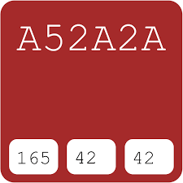
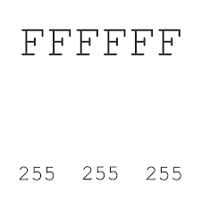
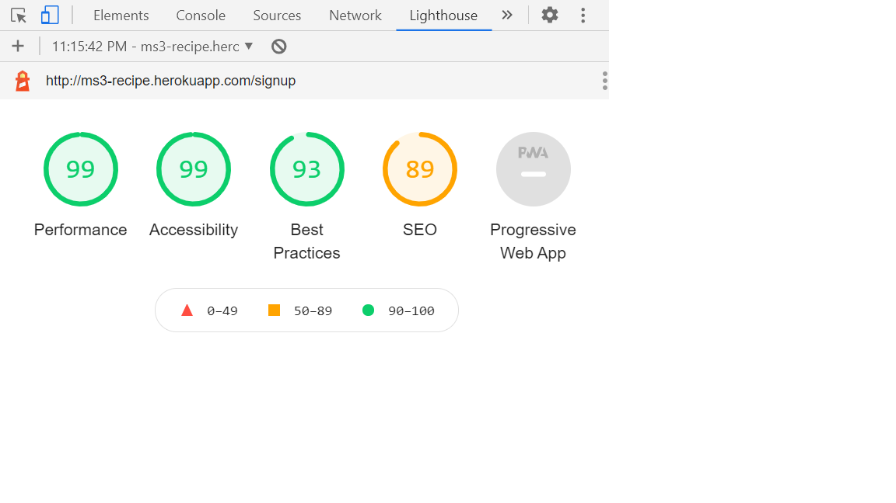

<h1 align="center">Ruby's Kitchen</h1>
<h1 align="center"></h1>

-[Live Website](http://ms3-recipe.herokuapp.com/home)

-[GitHub Repository](https://github.com/RubySrivastava/ms3-recipe)
 
 ## About

This project is made for food lovers who wants to try to cook himself and like to try different flavour.
This website is made with the personal experience of site owner who likes to cook and share his recipe so that others can also explore the recipe. 
For site owners it will be utility to increase their presence over the internet which lead to increase their business by adding more content by himself and others can also contribute by their recipe.
It is designed to be responsive on all devices and easy to navigate for users and owner.

## Table of Contents

[User Experience (UX)](#UX)

[Features](#features)

[Design](#design)

[Technologies Used](#technologies)

[Testing](#testing)

[Deployment](#deployment)

[Known Bugs](#bugs)

[Credits](#credits)

## User Experience (UX)

### User Stories

This website gives the information about different recipe with cooking method posted by site owner and other users. 
Any food lover who wants to come and explore different taste then this website is perfect for him.
In this website he gets the information about different recipe based on category and can also post his recipe.
This site also provides to create your own account and post recipe.

- #### Generic User
    1. I want to easily understand the purpose and the layout of the site without additional instructions needed.
    1. I want to intuitively navigate through the site to browse the content.
    1. I want the site is responsive on all device as I usually use phone for doing all such type of stuff.
    1. I want to be able to use the website on any device so I can keep it handy.
    1. I want to use the navigation at all times and have it readily available so I can quickly navigate from one page to another.

- ####  Admin/Site Owner
    1. As a site owner I want to read all the recipe.
    1. As a site owner I want to add, edit and delete my recipe.
    1. As a site owner I can delete others recipe from my site but can not edit whenever I want.
    1. As a site owner I want manage categories of recipes.I want to add, edit and delete the category.
    1. As a site owner I want to recieve the feedback of users.
    
- #### User who wants to get recipe
    1. I want to check the recipe without login or sign up on site.
    1. I want to get recipe by search option.
    1. I want to contact the site owner by sending message without login or sign up.
    1. I want to request the site owner for newsletter without login or sign up.

- #### User who wants to post recipe
    1. I want to create my profile by sign up.
    1. I want to easliy login and check my page.
    1. I want to add new recipe on my page and available to all users of site.
    1. I want to edit and delete my recipe only.
    1. I want to contact the site owner by sending simply message.
    1. I want to request for newsletter.
    
     
## Design

### Colour 
      
- #### This website is design for food lovers who loves to eat and needs lots of motivation to cook.
    The main color which is used for header and footer is spring wood.
    
    
    
- #### The black, brown and white color is used for text-color and background-color for links and buttons which show intelligence and simplicity respectively.Because of this color the content looks simple and clear.
      
    
    
    
      
### Typography

- #### The main font used is a cinzel with serif as a fallback font.
- #### The second font used is a Expo for brand name ,footer details and titles.

### Imagery

- #### 
    -[Image Optimizer](http://jpeg-optimizer.com/)

### Mockups

- #### Mockups were created using Adobe Xd.
    -[Desktop Wireframes](https://xd.adobe.com/view/08b0941d-7b49-4297-86cf-c7491db53f06-5de3/)
    
    -[Mobile Wireframes]()
- #### Mockup made through original website 
    -[Wireframes](https://techsini.com/multi-mockup/index.php)
    
    
    
    
    
    
    

## Features

### Existing Features

- #### Common Features Across All Pages

    - Header allows user to easily navigate across all pages
      - The header itself is positioned to always be visible (positioned absolutely using Bootstrap 'fixed-top' class) at the top of the screen (mobile and desktop) which allows visitors to find it quickly.
      - The brand logo is positioned on the left and is visible on all pages.
      - Navigation is included in the header to let the user intuitively locate it.
      - Navigation links is more visible when hovered over. This lets the visitor know that it is clickable.
      - Navigation links collapse in a home menu when viewed on mobile device.
    
    - Accessibility
      - All Pages have a description in case the image link breaks as well as helps screen readers.
      - The home menu has aria-label added to let users with screen readers know where the toggleable menu is.
    
    - Buttons
      - All buttons are styled in the way to provide consistency across the page. 

    - Responsiveness
      - All Pages are responsive on different viewport size.

    - Footer
      - Footer has been designed to be at the bottom of the page, regardless of the amount of content. This aids the overall user experience.
      - All content has been spaced out and aligned to the center.
      - There are social links and when hovered over, it changed the color.

### Specific to Pages
- Home Page
    - This page has header, footer and search box. This page has also list of all recipe with name and image.The header has navigation bar and footer has copyright and social links.The image brings the user's attention and inviting the user to explore the website.

- Contact Page
    - This page contains a form where users can give feedback and ask questions. It has another form where users can request for newsletter by simply subscribe it. 

- Login Page 
    - This page has login form. After login user will reach on his page.

- Sign Up Page
    - This page has sign up form. After sign up a profile page created where users can add recipe.

- My Page 
    - This page consist of all recipes of respective user.

- Category Page
    - Only admin can access this page. In this page admin can manage categories.

- Recipe Description Page
    - This page displays recipe description of selected recipe.

### Future Features
  - Create a way for the user to rate the website without having to type up feedback.
  - A page where people can review the comments.

## Technologies Used

### Languages Used

  - [HTML5](https://en.wikipedia.org/wiki/HTML5)
  - [CSS3](https://en.wikipedia.org/wiki/Cascading_Style_Sheets)
  - [JavaScript](https://en.wikipedia.org/wiki/Javascript)
  - [Jquery](https://en.wikipedia.org/wiki/JQuery)
  - [Python](https://en.wikipedia.org/wiki/Python_(programming_language))

### Frameworks, Libraries and Programs Used

  - [Bootstrap v4.5.0](https://getbootstrap.com/) - Used for the responsive layout as well as custom components such as header, footer, images, icons, grids, cards, and collapse element.
  - [Font Awesome](https://fontawesome.com/) - Font Awesome is used to add social icons for socila links and icons for about us page.
  - [Google Fonts](https://fonts.google.com/) - Google Fonts is used to import 'Expo'
  - [Git](https://git-scm.com/) - Git is used to allow for tracking of any changes in the code and for the version control.
  - [GitPod](https://www.gitpod.io/) - GitPod, connected to GitHub, hosted the coding space and allowed the project to be committed to the Github repository.
  - [Github](https://github.com/) - GitHub is used to host the project files and publish the live website by using Git Pages.
  - [Heroku](https://www.heroku.com/) - Heroku is the cloud platform to deploying the app.
  - [Flask](https://flask.palletsprojects.com/en/1.1.x/) - Flask is the web framework for the app.
  - [Jinja](https://jinja.palletsprojects.com/en/2.11.x/) - Jinja is used for Python template.
  - [Werkzeug](https://werkzeug.palletsprojects.com/en/1.0.x/) - Werkzeug is used for password hashing and authentication and autohorization.
  - [Adobe Xd](https://www.adobe.com/ie/products/xd.html) - Adobe Xd is used to create mockups.
  

### Database

  - [MongoDB](https://www.mongodb.com/) - MongoDB is the fully managed cloud database service used for the project.
  
  

## Testing

### Functionality Testing
  - #### Navigation bar
     - The navigation bar stays at the top of the page on all screen sizes.
            - When the nav links clicks it opens the relevent page in same window with same header footer.
  - #### Footer
     - Footer is located at the bottom of the page regardless of the content amount.
     - When the social links are clicked, they open the relevant social media page in a new tab.
  
  - All external links is tested to make sure they open up the correct pages in new tabs.
  - All internal links is tested to make sure that all pages are correctly connected.
    
### CSS3 validator 
Validate by direct input 
    [CSS Validator](https://jigsaw.w3.org/css-validator/)
  - Test result : No Error Found But Warning

### HTML5 validator
Vaidate by direct input 
    [HTML5 Validator](https://validator.w3.org/#validate_by_input)
  - Test result : 

### JavaScript validator
Validate by direct input
    [JavaScript Validator](https://jshint.com/)
  - Test result : No Error Found But Warning

### Python Validator
Validate by direct input
    [Pyhton Validator](http://pep8online.com/)
  - Test result : Pass

### Usability Testing
  - This website is shared on slack channel to get the feedback.This is also shared with friends to check on different device and accessbility.

### Compatibility Testing
  - #### Browser Compatibility
    - Tested on Chrome, Firefox, Opera, Internet Explorer, Microsoft Edge, Safari.
  - #### OS Compatibility
    - Tested on iOS , Android 10 and Windows 10.
  - #### Tested for responsivness on [Chrome DevTools](https://developers.google.com/web/tools/chrome-devtools). 

### Performance Testing
  - #### Tested on Developer Tools Lighthouse.
    - To run a report

        1. Download Google Chrome for Desktop.
        2. In Google Chrome, go to the URL you want to audit. You can audit any URL on the web.
        3. Open Chrome DevTools.
        4. Click the Audits tab.
        5. To the left is the viewport of the page that will be audited. To the right is the Audits panel of Chrome DevTools, which is now powered by Lighthouse.
        6. Click Perform an audit. DevTools shows you a list of audit categories. Leave them all enabled.
        7. Click Run audit. After 30 to 60 seconds, Lighthouse gives you a report on the page.

  - #### A Lighthouse report in Chrome DevTools
    - Home Page Desktop and Mobile

     
     

    - Contact Page Desktop and Mobile

     
     

    - Login Page Desktop and Mobile

      
      

    - Signup Page Desktop and Mobile

      
      

    - My Page Desktop and Mobile

      
      

    - Recipe Description Page Desktop and Mobile

      
      

    - Manage Category Page Desktop and Mobile
   
      
      

### Testing User Stories 
- #### Generic User
    - I easily understand the purpose and the layout of the site without additional instructions needed.
    - The landing page is simple and clear with a search box and list of all recipe. 
    - All pages of website has navigation bar and footer. 
    - With navigation bar I can easily access diiferent page and go anywhere from present page and come back.
    - Footer has social link. If I click on link it open the relevant page on different tab so I can easily check the social activity.
    - I want to access external links and be able to learn more about each page.
        - Home Page
            - Home page provides the search box to search the specific recipe and list of all recipe of site.
        - Contact Page
            - Contact page provides me contact form for feedback or query and subscriber form for newsletter.
        - Login Page
            -  In this page I login to the website and open my page.
        - Signup Page
            - In this page I create my account by filling the form and be able to post recipe.
        - My Page
            - In this page I can see all my recipe. I can also add, edit and delete my recipe.
        - Recipe Description Page    
            - In this page I can see the description of recipe with image.
        - Manage Category Page
            - This page can be accessed by only admin. In this page admin can manage category.

- #### Admin/Site Owner 
    - I get all recipe list posted by me and others also.
    - I can add new recipe on my page.
    - I can edit and delete my recipe anytime.
    - I can delete others recipe from my website.
    - I can add new category.
    - I can edit and delete existing categories.
    - I can get feedback and queries of users by mail.

- #### User who wants to get recipe 
    - I get the list of all recipe with recipe description.
    - I get the specific recipe by search option.
    - I can contact to site owner by contact form and also can give feedback.
    - I can request for newsletter by subscriber form.
    - I can also create my account on website by login form.
    
- #### User who wants to post recipe
    - I can easily post recipe on my page after login.
    - I can edit and delete my recipe from website anytime.
    - I can see all recipe of website but can not edit and delete others recipe.
    - I can not manage category. Only admin can manage category.   

## Deployment

- ### Working with the local copy
  1. Install all the requirements: Go to the workspace of your local copy. In the terminal window of your IDE type: pip3 install -r requirements.txt.
  2. Create a database in MongoDB
     - Signup or login to your MongoDB account.
     - Create a cluster and a database.
     - Create four collections in the db: categories, recipes, subscribers, users.
     - Add string values for the collections. See my Information architecture how the database is set up for this project.
  3. Create the environment variables
     - Create a .gitignore file in the root directory of the project.
     - Add the env.py file in the .gitignore.
     - Create the file env.py. This will contain all the envornment variables.
        - Import os
        - os.environ.setdefault("IP", "Added by developer")
        - os.environ.setdefault("PORT", "Added by developer")
        - os.environ.setdefault("SECRET_KEY", "Added by developer")
        - os.environ.setdefault("MONGO_URI", "Added by developer")
        - os.environ.setdefault("MONGO_DBNAME", "Added by developer")
  4. Run the app: Open your terminal window in your IDE. Type python3 app.py and run the app.
  
- ### Heroku Deployment
  1. Set up local workspace for Heroku
     - In terminal window of your IDE type: pip3 freeze -- local > requirements.txt. (The file is needed for Heroku to know which filed to install.)
     - In termial window of your IDE type: python app.py > Procfile (The file is needed for Heroku to know which file is needed as entry point.)
  2. Set up Heroku: create a Heroku account and create a new app and select your region.
  3. Deployment method 'Github'
     - Click on the Connect to GitHub section in the deploy tab in Heroku.
       - Search your repository to connect with it.
       - When your repository appears click on connect to connect your repository with the Heroku.
     - Go to the settings app in Heroku and go to Config Vars. Click on Reveal Config Vars.
       - Enter the variables contained in your env.py file. it is about: IP, PORT, SECRET_KEY, MONGO_URI, MONGO_DBNAME
  4. Push the requirements.txt and Procfile to repository.
     - $ git add requirements.txt
     - $ git commit -m "Add requirements.txt"
     - $ git add Procfile 
     - $ git commit -m "Add Procfile"
  5. Automatic deployment: Go to the deploy tab in Heroku and scroll down to Aotmatic deployments. Click on Enable Automatic Deploys. By Manual deploy click on Deploy Branch.

  Heroku will receive the code from Github and host the app using the required packages. Click on Open app in the right corner of your Heroku account. The app wil open and the live link is available from the address bar. 

- ### Forking
  If you wish to contribute to this website you can Fork it without affecting the main branch by following the procedure outlined below.
  1. Go to the GitHub website and log in.
  2. Locate the [Repository](https://github.com/RubySrivastava/ms3-recipe) used for this project.
  3. On the right-hand side of the Repository name, you'll see the 'Fork' button. It's located next to the 'Star' and 'Watch' buttons.
  4. This will create a copy in your personal repository.
  5. Once you're finished making changes you can locate the 'New Pull Request' button just above the file listing in the original repository.

- ### Cloning 
  If you wish to clone or download this repository to your local device you can follow the procedure outlined below.
  1. Go to the GitHub website and log in.
  2. Locate the [Repository](https://github.com/RubySrivastava/ms3-recipe) used for this project.
  3. Under the Repository name locate 'Clone or Download' button in green.
  4. To clone the repository using HTTPS click the link under "Clone with HTTPS".
  5. Open your Terminal and go to a directory where you want the cloned directory to be copied in.
  6. Type `Git Clone` and paste the URL you copied from the GitHub.
  7. To create your local clone press `Enter`

## Known Bugs

There are no identified bugs as at now.

## Credits

### Code :

- Bootstrap library was used to create a responsive design. 
 
### Content :

- All code was written by the Ruby Srivastava.

- To write up a README file the most helpful documents were
    - Code Institute [SampleREADME](https://github.com/Code-Institute-Solutions/SampleREADME)
    - Code Institute [README Template](https://github.com/Code-Institute-Solutions/readme-template)
    - [Markdown Cheatsheet](https://github.com/adam-p/markdown-here/wiki/Markdown-Cheatsheet#code)
    
- To write up the content of page the most helpful site is
    - All Recipe Page [Official Website](https://www.allrecipes.com/)
    

### Media :
- All images used were taken from [UnSplash website](https://unsplash.com/)

### Acknowledgements :

- I was inspired by the people of surrounding me who are foodie, loves cooking and love to try new recipe.
- Thanks to my fellow student and tutors on slack channel who helped me in some way.
- Thanks to my mentor Maranatha Ilesalnmi for helping me throughout the project and giving me important suggestions and feedback of my work.
 